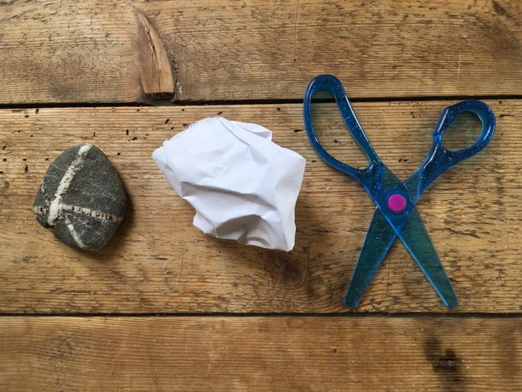

<!-- PROJECT LOGO -->
<br />
<p align="center">
  <a href="https://github.com/mack24x7/rps-dotnetcore">
    
  </a>

  <h3 align="center">Rock Paper Scissors TDD for .NET Core</h3>

  <p align="center">
    A simple Rock, Paper, Scissors game, written using TDD in .NET Core and NUnit.
    <br />
    <a href="https://github.com/mack24x7/rps-dotnetcore"><strong>Explore the docs »</strong></a>
    <br />
    <br />
    <a href="https://github.com/mack24x7/rps-dotnetcore">View Demo</a>
    ·
    <a href="https://github.com/mack24x7/rps-dotnetcore/issues">Report Bug</a>
    ·
    <a href="https://github.com/mack24x7/rps-dotnetcore/issues">Request Feature</a>
  </p>
</p>


<!-- TABLE OF CONTENTS -->
<details open="open">
  <summary>Table of Contents</summary>
  <ol>
    <li>
      <a href="#about-the-project">About The Project</a>
      <ul>
        <li><a href="#built-with">Built With</a></li>
      </ul>
    </li>
    <li>
      <a href="#getting-started">Getting Started</a>
      <ul>
        <li><a href="#prerequisites">Prerequisites</a></li>
        <li><a href="#installation">Installation</a></li>
      </ul>
    </li>
    <li><a href="#usage">Usage</a></li>
    <li><a href="#roadmap">Roadmap</a></li>
    <li><a href="#contributing">Contributing</a></li>
    <li><a href="#license">License</a></li>
    <li><a href="#contact">Contact</a></li>
    <li><a href="#acknowledgements">Acknowledgements</a></li>
  </ol>
</details>


<!-- ABOUT THE PROJECT -->
## About The Project

[![Product Name Screen Shot][product-screenshot]](https://example.com)

This project is designed for a lab environment within a TDD Course. Students will build out a simple Rock, Paper, Scissors game with .NET Core and NUnit.

### Built With

* [Visual Studio 2019 Community](https://visualstudio.microsoft.com/vs/community/)
* [.NET Core](https://dotnet.microsoft.com/download/dotnet-core)
* [NUnit](https://nunit.org)


<!-- GETTING STARTED -->
## Getting Started

### Prerequisites

None, other than an installation of Visual Studio Community or Visual Studio Code.

### Installation

Simply clone the repo
   ```sh
   git clone https://github.com/mack24x7/rps-dotnetcore.git
   ```


<!-- LICENSE -->
## License

Distributed under the MIT License. See `LICENSE` for more information.

<!-- CONTACT -->
## Contact

Joe Mack - mack.joe@live.com

Project Link: [https://github.com/mack24x7/rps-dotnetcore](https://github.com/mack24x7/rps-dotnetcore)


<!-- MARKDOWN LINKS & IMAGES -->
<!-- https://www.markdownguide.org/basic-syntax/#reference-style-links -->
[contributors-shield]: https://img.shields.io/github/contributors/othneildrew/Best-README-Template.svg?style=for-the-badge
[contributors-url]: https://github.com/othneildrew/Best-README-Template/graphs/contributors
[forks-shield]: https://img.shields.io/github/forks/othneildrew/Best-README-Template.svg?style=for-the-badge
[forks-url]: https://github.com/othneildrew/Best-README-Template/network/members
[stars-shield]: https://img.shields.io/github/stars/othneildrew/Best-README-Template.svg?style=for-the-badge
[stars-url]: https://github.com/othneildrew/Best-README-Template/stargazers
[issues-shield]: https://img.shields.io/github/issues/othneildrew/Best-README-Template.svg?style=for-the-badge
[issues-url]: https://github.com/othneildrew/Best-README-Template/issues
[license-shield]: https://img.shields.io/github/license/othneildrew/Best-README-Template.svg?style=for-the-badge
[license-url]: https://github.com/othneildrew/Best-README-Template/blob/master/LICENSE.txt
[linkedin-shield]: https://img.shields.io/badge/-LinkedIn-black.svg?style=for-the-badge&logo=linkedin&colorB=555
[linkedin-url]: https://linkedin.com/in/othneildrew
[product-screenshot]: images/screenshot.png